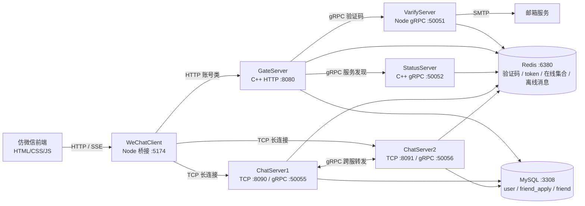

# MiniChat · 仿微信分布式即时通讯系统

> 基于 **C++ / Boost.Asio / gRPC / MySQL / Redis** 的高并发即时通讯后端，配套 Node 桥接服务与仿微信前端。
> 单机双 ChatServer 实测可实时支撑 **1 万条 TCP 长连接**，在 100 倍 fanout 场景下实时推送约 **5 万 notify/s**，ACK / Notify 成功率 **100%**。

<p>
  
  
  
  
  
  
</p>

---

## 目录

- [一、项目简介](#一项目简介)
- [二、为什么值得一看（核心亮点）](#二为什么值得一看核心亮点)
- [三、技术栈](#三技术栈)
- [四、系统架构](#四系统架构)
- [五、核心技术实现](#五核心技术实现)
- [六、性能压测与优化（项目重点）](#六性能压测与优化项目重点)
- [七、关键业务流程](#七关键业务流程)
- [八、数据设计](#八数据设计)
- [九、目录结构](#九目录结构)
- [十、快速开始](#十快速开始)
- [十一、可继续优化方向](#十一可继续优化方向)

---

## 一、项目简介

MiniChat 是一个**仿微信的分布式即时通讯系统**，采用微服务方式拆分账号、状态、聊天三类职责，服务之间通过 gRPC 通信，客户端与聊天服务之间使用自定义 TCP 协议维持长连接。

系统实现了一条完整的端到端链路：**邮箱验证码注册 → 登录鉴权 → 服务发现与分配 → 好友搜索 / 申请 / 认证 → 实时文本聊天 → 跨 ChatServer 消息转发 → 离线消息拉取 → 心跳保活**。

在此基础上，我设计并执行了一套**自动化压测方案**，将系统压到 1 万条长连接，定位出高 fanout 下的推送排队瓶颈，并针对性地做了业务队列分片、连接池参数化、ACK 前置等优化——这条「**压测 → 定位瓶颈 → 优化 → 复测**」的闭环是本项目的核心价值所在。

---

## 二、为什么值得一看（核心亮点）

| 维度 | 亮点 |
| --- | --- |
| **网络编程** | 基于 Boost.Asio 的全异步 IO + IO 线程池；手写 TCP 应用层协议，自行处理**粘包 / 半包** |
| **高并发** | 业务逻辑**分片队列 + 多 worker 消费**，锁仅保护入队 / 出队，回调执行前释放锁 |
| **分布式** | 多 ChatServer 集群，借助 Redis 在线集合 + gRPC 实现**跨服消息 fan-out** 与多端登录 |
| **连接池** | 自实现 MySQL 连接池，含**后台心跳探活与自动重连**；Redis / gRPC 连接池均可配置 |
| **可靠性** | 接收方离线时消息落 Redis 队列，登录时批量拉取，保证**离线一致性** |
| **性能工程** | 有**真实可复现的压测数据**支撑（含 CPU / 内存采样、P95 / P99 延迟），结论克制诚实 |
| **可调优性** | 关键参数（IO 线程、worker 数、连接池大小、日志开关）全部**环境变量化**，便于不同机器调优 |

> 说明：本项目的基础技术栈与微服务骨架参考了开源的 C++ 全栈聊天教程，我在其之上**独立完成了系统化压测、瓶颈分析与性能优化**，并补全了架构与压测文档。下文中的压测数据均为本机真实测得。

---

## 三、技术栈

| 模块 | 技术 |
| --- | --- |
| HTTP 网关 / 聊天服务 / 状态服务 | C++17、Boost.Asio、Boost.Beast、JsonCpp |
| 服务间通信 | gRPC、Protocol Buffers |
| 验证码服务 | Node.js、@grpc/grpc-js、Nodemailer（SMTP） |
| 前端桥接 | Node.js、HTTP Server、TCP Socket、SSE |
| 前端页面 | 原生 HTML / CSS / JavaScript（仿微信 UI） |
| 存储 | MySQL（业务持久化）、Redis（验证码 / token / 在线状态 / 缓存 / 离线消息） |
| 构建 | Visual Studio C++ 工程、npm |

---

## 四、系统架构

系统分为**前端接入层 → 账号网关层 → 状态服务层 → 聊天服务集群 → 数据存储层**五层。



| 服务 | 职责 | 端口 |
| --- | --- | --- |
| **WeChatClient** | 浏览器 ↔ 后端桥接层；HTTP 代理 + TCP 连接 ChatServer + SSE 推送 | `5174` |
| **GateServer** | HTTP 网关：注册、登录、验证码、密码重置 | `8080` |
| **VarifyServer** | 验证码 gRPC 服务：生成验证码、写 Redis（TTL 60s）、SMTP 发信 | `50051` |
| **StatusServer** | 服务发现：选择 ChatServer、生成并下发 token | `50052` |
| **ChatServer1 / 2** | 聊天长连接、好友关系、消息收发、跨服转发、离线消息 | `8090 / 8091`（gRPC `50055 / 50056`） |
| **MySQL / Redis** | 业务持久化 / 状态与缓存 | `3308 / 6380` |

> **为什么需要 Node 桥接层？** 浏览器无法直接使用项目的原生 TCP 协议连接 ChatServer，因此由 WeChatClient 用 Node TCP Socket 连接聊天服务，并通过 SSE 将服务端推送转发给浏览器。

---

## 五、核心技术实现

### 5.1 自定义 TCP 应用层协议（粘包 / 半包处理）

聊天链路使用 `[2 字节 msg_id][2 字节 msg_len][msg_body]` 的二进制协议，头部字段做网络字节序转换。`CSession` 通过「**先读满定长头部 → 解析出包体长度 → 再读满包体**」的方式递归补读，正确处理 TCP 流式传输下的粘包与半包，读满一个完整包后再投递给业务层。

### 5.2 Boost.Asio 异步 IO + IO 线程池

`AsioIOServicePool` 维护一组 `io_context` 与对应工作线程，新连接以**轮询（round-robin）** 方式分配到不同 IO 线程上，避免单线程瓶颈。IO 线程数通过 `MINICHAT_IO_THREADS` 可配置。所有读写均为异步回调，配合 `shared_from_this()` 保证连接对象在异步操作期间的生命周期安全。

### 5.3 业务逻辑分片队列 + 多 worker

`LogicSystem` 将聊天业务请求按**多分片队列**分发给多个 worker 线程消费（数量由 `MINICHAT_LOGIC_WORKERS` 配置），避免所有请求挤在单队列、单消费线程上。队列锁**只保护入队 / 出队**，回调真正执行前即释放锁，显著降低锁竞争与队列阻塞——这是压测后定位到「单逻辑队列排队」问题后做的关键优化。

### 5.4 连接池

- **MySQL 连接池**（自实现，生产级）：启动时预建连接，`condition_variable` 优雅等待空闲连接，**后台心跳线程每 60s 执行 `SELECT 1` 探活并自动重连**，连接借还采用 RAII（`Defer`）保证归还，并复位事务 / autocommit 状态。
- **Redis 连接池**：基于 `redis-plus-plus`，池大小由 `MINICHAT_REDIS_POOL_SIZE` 配置。
- **跨服 gRPC 连接池**：维护到其他 ChatServer 的 stub 池，大小由 `MINICHAT_CHAT_GRPC_POOL_SIZE` 配置。

### 5.5 跨 ChatServer 消息 fan-out 与多端登录

用户登录聊天服务后，其所在服务名写入 Redis Set `uip_<uid>`，表示该用户**当前在线的 ChatServer 集合**，天然支持多端登录。发送消息 / 好友申请时：

1. 查 `uip_<touid>` 判断接收方所在服务器；
2. 在**本服**则直接走本地 session 推送；
3. 在**他服**则通过 gRPC 调用目标 ChatServer 转发通知，并向对方的多端 session fan-out；
4. **离线**则写入 Redis 队列。

### 5.6 离线消息

接收方不在线或转发失败时，消息以 JSON 形式 `RPUSH` 到 `offline_msg_<uid>`，用户下次登录时批量拉取（最多 200 条）并随登录响应返回前端，保证离线一致性。

### 5.7 异步消息持久化与历史查询

所有文本消息都会落库到 `chat_message` 表，形成可查询的聊天记录。关键在于**不破坏前面的性能优化**：文本消息热路径仍然「先回 ACK」，持久化由独立的 `MsgPersistMgr` 完成——它把消息推入内存队列，由专用 writer 线程**批量写入** MySQL，**磁盘 IO 完全不在请求延迟路径上**。

- **会话规整**：单聊会话 ID 取 `min(uid)_max(uid)`，保证双向一致、只存一份；
- **幂等去重**：`(session_id, unique_id)` 唯一键 + `INSERT IGNORE`，重复投递/跨服转发不会重复落库；
- **游标分页**：历史查询按 `session_id + msg_id` 游标向前翻页（`WHERE msg_id < ? ORDER BY msg_id DESC LIMIT ?`），避免大表 `OFFSET` 退化；
- **优雅退出**：进程关停时 flush 队列，尽量不丢缓冲中的消息；
- 批量大小、worker 通过 `MINICHAT_PERSIST_BATCH` 可调。

> 这是一个典型的「**加功能但不回退性能**」案例：把写库放到 ACK 之后、异步批量化，既补齐了聊天记录这一核心能力，又守住了之前压出来的实时吞吐。

---

## 六、性能压测与优化（项目重点）

> 本节是项目的核心。所有数据均在**本机真实测得**并附原始 JSON，结论刻意区分「实时可用」与「可靠但非实时」，不做夸大。

### 6.1 测试方法

自研压测客户端建立大量 TCP 长连接并按阶梯速率发送消息，采集**端到端 ACK / Notify 的 P95 / P99 延迟、成功率，以及服务端 CPU / 内存占用**。

| 项目 | 配置 |
| --- | --- |
| 用户数 / 每用户连接数 | 100 / 100 → 共 **10000 条 TCP 长连接** |
| fanout | **100 通知 / 逻辑消息**（极端放大场景） |
| 阶梯速率 | 500 → 1500 → 3000 message/s |
| ChatServer | 双实例（8090 / 8091） |
| 构建 / 部署 | Debug x64，服务端与压测客户端**同机** |

**「实时可用」判定标准**：ACK 成功率 = 100% 且 Notify 成功率 = 100% 且 P95 处于亚秒级。

### 6.2 压测结论

| 目标 msg/s | 实际 msg/s | 实际 notify/s | ACK 成功率 | Notify 成功率 | ACK P95 | Notify P95 | Notify P99 | 结论 |
| ---: | ---: | ---: | ---: | ---: | ---: | ---: | ---: | --- |
| 500 | 500 | **50,000** | 100% | 100% | 584 ms | **641 ms** | 897 ms | ✅ 实时可用 |
| 1500 | 1500 | 150,000 | 100% | 100% | 5383 ms | 5386 ms | 5745 ms | ⚠️ 可靠但非实时 |
| 3000 | 2997 | 299,500 | 100% | 100% | 25793 ms | 25800 ms | 27905 ms | ⚠️ 可靠峰值，延迟过高 |

资源占用：CPU 平均 / 峰值 `17.07% / 73.15%`，内存平均 / 峰值 `492 MB / 500 MB`。

> **一句话结论**：单机双 ChatServer 可实时支撑 1 万条 TCP 长连接；100 倍 fanout 下实时可用吞吐约 500 message/s（≈ 50,000 notify/s），Notify P95 641ms，ACK / Notify 成功率 100%。继续升到 1500–3000 message/s 仍能可靠投递，但 P95 进入秒级到十秒级，更适合作为可靠峰值而非实时指标。

### 6.3 基于压测做的优化

压测早期版本在 1 万长连接下实时可用吞吐仅约 **200 message/s**，瓶颈集中在同步日志 IO 与单业务队列排队。据此做了如下优化：

| 优化项 | 作用 |
| --- | --- |
| **业务队列分片 + 多 worker** | 避免所有聊天请求挤在单队列、单消费线程 |
| **锁仅保护入队 / 出队** | 回调执行前释放锁，降低锁竞争与排队 |
| **文本消息 ACK 前置** | 服务端收到消息先回 ACK，再做 fanout / 离线保存，降低发送方感知延迟 |
| **关闭同步标准输出日志**（`MINICHAT_DISABLE_STD_LOG`） | 压测时去除控制台 IO 对吞吐 / 延迟的干扰 |
| **连接池 / 线程数全部参数化** | Redis、跨服 gRPC、IO 线程、worker 数均可按机器调优 |

优化后实时可用吞吐由 200 → **500 message/s**（≈ 50,000 notify/s），成功率 100%。

### 6.4 瓶颈分析

当前瓶颈不在单条消息处理，而在**高 fanout 下的推送写入压力**：一条逻辑消息被放大成 100 次连接写入，随着 message/s 提升，通知写入与业务队列累积排队，导致 P95 延迟攀升。后续优先方向见[第十一节](#十一可继续优化方向)。

> 📂 原始数据与详细报告：
> [`docs/performance-optimization.md`](docs/performance-optimization.md) ·
> [`load_results/optimization_report_20260602.md`](load_results/optimization_report_20260602.md) ·
> [`load_results/push_throughput_20260602.md`](load_results/push_throughput_20260602.md) ·
> [`load_results/`](load_results/)（含每轮压测的 `*.summary.json` 与 `*.samples.json`）

---

## 七、关键业务流程

<details>
<summary><b>注册</b>（点击展开）</summary>

1. 前端请求验证码 → GateServer 调 VarifyServer 生成验证码，写 Redis `code_<email>`（TTL 60s）并 SMTP 发信；
2. 用户提交注册信息 → GateServer 校验验证码 → 写入 MySQL `user` 表。
</details>

<details>
<summary><b>登录 + 服务发现</b></summary>

1. GateServer 校验账号密码 → 调 StatusServer `GetChatServer`；
2. StatusServer 选择 ChatServer、生成 token 写入 Redis `utoken_<uid>`，返回 `host / port / token`；
3. 前端用 TCP 连接对应 ChatServer → ChatServer 校验 token；
4. 登录成功后返回用户信息、好友申请列表、好友列表、离线消息，并 `SADD uip_<uid> chatserverX`。
</details>

<details>
<summary><b>好友申请 / 认证</b></summary>

1. 申请写入 MySQL `friend_apply`；查 `uip_<uid>` 判断对方在线状态；
2. 同服直接推送、跨服 gRPC 转发、离线则登录时拉取；
3. 认证通过后更新 `friend_apply.status` 并在 `friend` 表写入双向好友关系，再通知对方。
</details>

<details>
<summary><b>文本聊天</b></summary>

1. ChatServer 先回 `1018` ACK；
2. 查 `uip_<touid>`：同服本地推送 / 他服 gRPC 转发 / 离线写入 `offline_msg_<uid>`；
3. 接收方下次登录批量拉取离线消息。
</details>

---

## 八、数据设计

**MySQL 核心表**

| 表名 | 作用 | 主要字段 |
| --- | --- | --- |
| `user` | 用户基础信息 | `uid`、`name`、`email`、`pwd`、`nick`、`icon` |
| `friend_apply` | 好友申请记录 | `from_uid`、`to_uid`、`status` |
| `friend` | 双向好友关系 | `self_id`、`friend_id`、`back` |
| `chat_message` | 聊天消息持久化（异步落库） | `msg_id`、`session_id`、`from_uid`、`to_uid`、`unique_id`、`content`、`create_time` |

> 建表语句见 [`docs/sql/chat_message.sql`](docs/sql/chat_message.sql)。

**Redis 核心 Key**

| Key | 类型 | 作用 |
| --- | --- | --- |
| `code_<email>` | String + TTL | 邮箱验证码，60s 过期 |
| `utoken_<uid>` | String | 登录 token |
| `uip_<uid>` | **Set** | 用户在线的 ChatServer 集合（多端登录 + 跨服 fan-out） |
| `ubaseinfo_<uid>` | String(JSON) | 用户基础信息缓存 |
| `offline_msg_<uid>` | **List** | 离线文本消息队列 |

---

## 九、目录结构

```
minichat/
├── WeChatClient/     # 仿微信前端 + Node 桥接服务（HTTP 代理 / TCP / SSE）
├── GateServer/       # C++ HTTP 网关：注册 / 登录 / 验证码 / 重置密码
├── VarifyServer/     # Node gRPC 验证码服务（SMTP 发信）
├── StatusServer/     # C++ gRPC 状态服务：服务发现 + token
├── ChatSever/        # C++ 聊天服务实例 chatserver1
├── ChatServer2/      # C++ 聊天服务实例 chatserver2
├── docs/             # 架构图、项目文档、性能优化说明
└── load_results/     # 压测结果、采样数据与报告
```

> 各服务的 `AsioIOServicePool`、`CSession`、`LogicSystem`、`MysqlDao`、`RedisMgr`、`ChatGrpcClient` 等是网络与并发实现的核心，可重点阅读。

---

## 十、快速开始

> 真实配置（邮箱授权码、数据库密码等）不入库。仓库提供 `config.example.*` 模板，首次运行复制为对应的 `config.ini` / `config.json` 后填写本机配置。

**依赖**：MySQL（`3308`）、Redis（`6380`）、Node.js、Visual Studio（C++ 工程）、Boost、gRPC、protobuf。

**启动顺序**：

```text
1. 启动 MySQL 与 Redis
2. 启动 VarifyServer        (npm start)
3. 启动 StatusServer        (C++)
4. 启动 ChatServer1 / 2     (C++)
5. 启动 GateServer          (C++)
6. 启动 WeChatClient        (npm start)
```

**访问**：浏览器打开 `http://127.0.0.1:5174`。

**压测调优参数（环境变量）**：

```powershell
$env:MINICHAT_DISABLE_STD_LOG     = "1"    # 关闭同步标准输出日志
$env:MINICHAT_LOGIC_WORKERS       = "8"    # 业务 worker 数
$env:MINICHAT_IO_THREADS          = "2"    # Asio IO 线程数
$env:MINICHAT_REDIS_POOL_SIZE     = "64"   # Redis 连接池大小
$env:MINICHAT_CHAT_GRPC_POOL_SIZE = "128"  # 跨服 gRPC 连接池大小
```

---

## 十一、可继续优化方向

项目仍有明确的演进空间，也是我对系统短板的认知：

- **Release 构建复测**：当前为 Debug 构建，Release 下吞吐与延迟应有明显改善；
- **压测客户端与服务端分机部署**，消除单机资源竞争；
- **异步日志系统**，替代同步标准输出；
- **更细粒度的推送调度 / 批量写入**，缓解高 fanout 写入压力；
- **聊天服务去重**：将两个 ChatServer 合并为「单工程 + 多配置」，消除源码复制；
- **消息可靠性增强**：在已落地的异步消息持久化基础上，继续做已读回执、送达状态与多端已读同步；
- **网关增强**：接口鉴权、限流、统一错误码与请求日志；
- **工程化**：Docker Compose 一键启动、敏感配置迁移至环境变量、补充自动化测试。

---

<p align="center"><i>本项目用于个人学习与求职展示，欢迎交流。</i></p>
