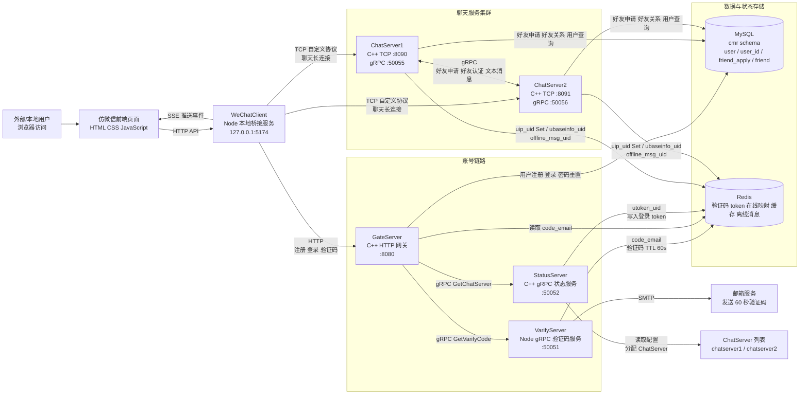

# 仿微信即时通讯系统架构图

最后更新：2026-06-02

## 架构说明

系统分为前端接入层、账号网关层、状态服务层、聊天服务集群和数据存储层。

WeChatClient 是浏览器和后端之间的桥接层。浏览器通过 HTTP 调用 WeChatClient，WeChatClient 再分别访问 GateServer 或 ChatServer。账号注册、登录、验证码等请求走 GateServer；聊天长连接、好友申请、好友认证和文本消息走 ChatServer TCP 协议。

GateServer 负责账号类 HTTP 接口。它通过 gRPC 调用 VarifyServer 生成验证码，通过 StatusServer 获取 ChatServer 地址和登录 token，并访问 MySQL / Redis 完成用户注册、登录和验证码校验。

StatusServer 负责聊天服务发现和 token 管理。用户登录成功后，StatusServer 选择一个 ChatServer，生成 token，并写入 Redis 的 `utoken_<uid>`。

ChatServer1 和 ChatServer2 构成聊天服务集群。用户登录聊天服务后，ChatServer 会把所在服务名写入 Redis 的 `uip_<uid>` Set，表示该用户当前在线的 ChatServer 集合，用于支持多端登录和跨服消息 fan-out。发送好友申请或文本消息时，如果目标用户在另一台 ChatServer，则通过 gRPC 跨服通知；如果目标用户离线，则写入 `offline_msg_<uid>`，下次登录时拉取。

## 性能压测结论

当前架构在本地单机双 ChatServer Debug 环境下完成了 10000 长连接压测：

| 指标 | 结果 |
| --- | --- |
| 极限可用连接数 | `10000` TCP 长连接 |
| 实时可用吞吐 | 约 `500 message/s` |
| 实时推送吞吐 | 约 `50,000 notify/s` |
| 可用样本 | `10000` 连接，`100` 倍 fanout，实际 `500 message/s` |
| ACK P95 | `584ms` |
| Notify P95 | `641ms` |
| ACK/Notify 成功率 | `100%` |
| 可靠峰值样本 | 约 `2997 message/s` / `299,500 notify/s`，Notify P95 `25.8s` |

详细压测报告见：`docs/performance-optimization.md`、`load_results/optimization_report_20260602.md`、`load_results/push_throughput_20260602.md`。
